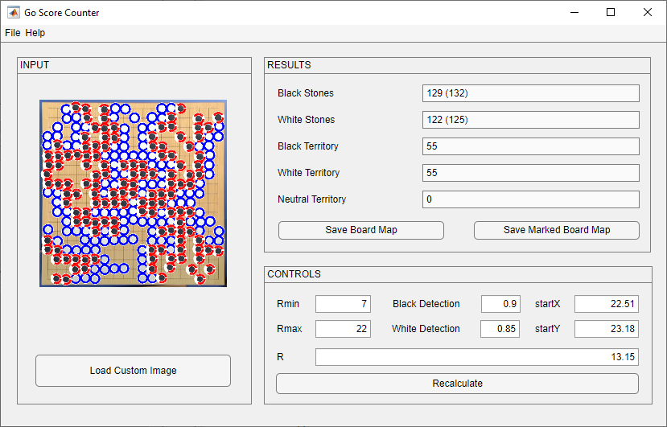

# Go Score Counter
A program for counting stones and empty areas and stones from Go board images.

## GUI

## Controls
- `Rmin` minimum radius to find stones (pixels)
- `Rmax` maximum radius to find stones (pixels)
- `R` step in virtual board generation (pixels)
- `Black detection` sensitivity to black stones/circles (0-1)
- `White detection` sensitivity to white stones/circles (0-1)
- `startX` top-left X point of Go board (pixels)
- `startY` top-left Y point of Go board (pixels)

## Results
- Before parentheses: actual amount in virtual board
- Inside parentheses: amount of circles found
- `Save Board Map` save virtual board with all stones and empty spaces to text
- `Save Marked Board Map` save virtual board with all stones + territories to text

## Virtual Board Notation
- `0` empty space (with Save Board Map) / neutral space (with Save Marked Board Map)
- `1` black stone
- `2` white stone
- `3` black territory
- `4` white territory
